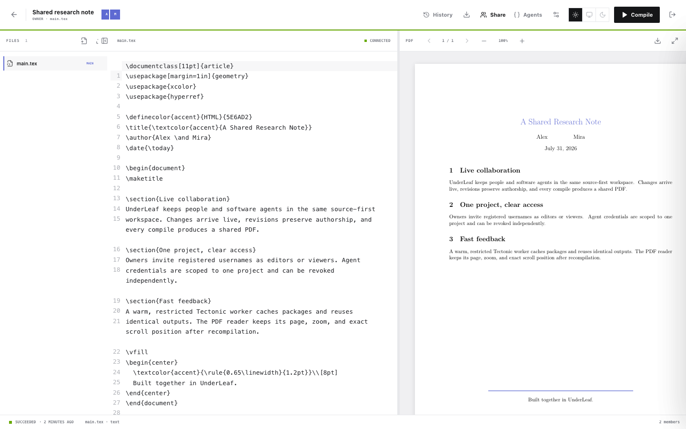
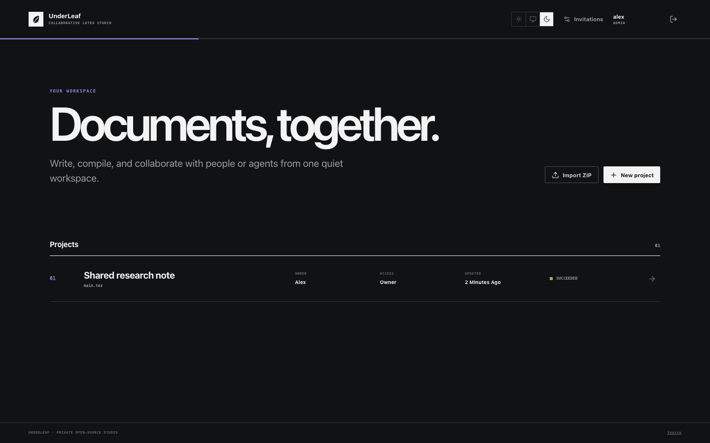
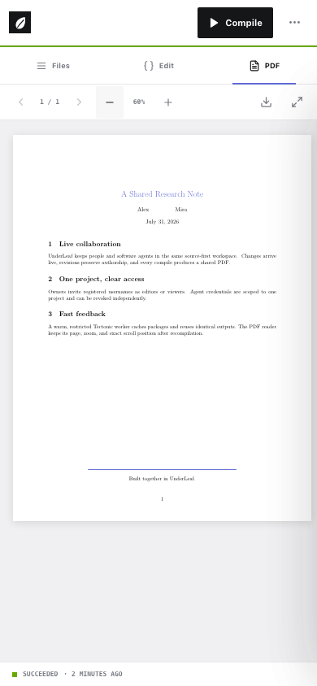

<div align="center">

# UnderLeaf

**A private, invite-only collaborative LaTeX studio for people and software agents.**

[Hosted app](https://debeltoni.github.io/UnderLeaf/) · [Agent guide](https://debeltoni.github.io/UnderLeaf/agent-guide.md) · [Questions / chat](https://github.com/DebelToni/UnderLeaf/issues/new)

[](https://github.com/DebelToni/UnderLeaf/actions/workflows/ci.yml)
[](https://github.com/DebelToni/UnderLeaf/actions/workflows/codeql.yml)
[](LICENSE)

</div>

<p align="center">
  
</p>

<p align="center">
  
  &nbsp;
  
</p>

UnderLeaf keeps accounts, projects, revision history, and compilation on your own machine while serving its browser interface from a stable GitHub Pages URL. A rotating Cloudflare Quick Tunnel connects that interface to the local backend without exposing a permanent inbound port.

The hosted instance is private and currently accepts new members through single-use invitation links. Questions about using or hosting UnderLeaf are welcome in [GitHub Issues](https://github.com/DebelToni/UnderLeaf/issues).

UnderLeaf is independent and unaffiliated with Overleaf or Underleaf.ai.

## What it includes

- Multi-file CodeMirror LaTeX editor with live Yjs/WebSocket collaboration and presence
- Owner, editor, and viewer project roles
- Restricted Docker/Tectonic compilation with a warm worker and persistent package cache
- Live compile state, logs, PDF replacement, and source-aware revision history
- PDF viewer that preserves page, zoom, and exact scroll position after recompilation
- One-click PDF-only mode with `Escape` to return
- Article, report, presentation, and blank templates; file uploads and ZIP import/export
- Light, dark, and system appearance across desktop and mobile layouts
- Project-scoped, revocable credentials for external agents
- SQLite persistence plus an online backup command with bounded snapshot retention

## Using the hosted instance

### 1. Register with an invitation

An administrator opens **Invitations**, selects **New invitation**, and sends the generated link privately.

- Each invitation can register one account.
- The link expires after seven days when created through the interface.
- Registration needs only a username and password.
- Registering does not automatically reveal or share any project.

Create a separate invitation for every person. If a link is consumed by the wrong person, create a replacement rather than sharing an account.

### 2. Create and share a project

1. Select **New project** on the dashboard.
2. Name it and choose a starting template.
3. Open **Share** inside the project.
4. Add the collaborator's exact registered username as **Editor** or **Viewer**.
5. The collaborator refreshes their dashboard and opens the shared project.

Editors can work in the same text file simultaneously. Presence appears in the header, changes synchronize live, and **History** records who produced each saved revision.

### 3. Compile and review

Select **Compile** to flush the current collaborative editor state and run Tectonic. Successful output appears in the PDF pane for every connected collaborator. A completely empty document body has no printable page, so add content between `\begin{document}` and `\end{document}` before compiling a blank template.

## External agent access

UnderLeaf does not embed an AI model or chat interface. A project owner can authorize an external coding agent to edit the project directly:

1. Open **Agents** in the project.
2. Create a named credential.
3. Give the agent the stable discovery link, project hash, and one-time password shown by UnderLeaf.

The credential grants access to that project only and can be revoked independently. Agents can read and edit files, create and restore revisions, compile, download PDFs, and export ZIP archives through the REST API. Mutations use `If-Match` revisions so an agent cannot silently overwrite a newer collaborator change.

- Human/agent guide: [`docs/agent-guide.md`](docs/agent-guide.md)
- Live guide: https://debeltoni.github.io/UnderLeaf/agent-guide.md
- OpenAPI: `/api/v1/openapi.json` on the discovered backend

## Architecture

```text
GitHub Pages frontend
        │ reads api.json from a stable URL
        ▼
Cloudflare Quick Tunnel ──► local Fastify server
                              ├─ SQLite accounts, projects, and revisions
                              ├─ Yjs collaboration and project WebSockets
                              └─ warm restricted Docker/Tectonic worker
```

The Quick Tunnel hostname may change whenever the host restarts. `scripts/tunnel.mjs` publishes the current hostname to `docs/api.json`, so users and agents keep one stable discovery URL.

## Self-hosting

### Requirements

- Node.js 24 or newer
- pnpm 10.27
- Docker Desktop or another compatible Docker engine
- `cloudflared`
- Git with permission to push to your GitHub repository
- A GitHub repository with Pages enabled

On macOS, Docker Desktop and `cloudflared` can be installed with their official installers or Homebrew. Confirm that Docker is running before the first compile.

### 1. Fork or clone

Keep the repository name `UnderLeaf` for the existing Pages base path:

```bash
git clone git@github.com:YOUR_USER/UnderLeaf.git
cd UnderLeaf
pnpm install --frozen-lockfile
cp .env.example .env
```

If you use a different repository name, update `base` in `apps/web/vite.config.ts` to `/<repository-name>/`.

### 2. Configure the deployment

Edit `.env` and replace the example account with your GitHub Pages origin and discovery URL:

```dotenv
UNDERLEAF_HOST=127.0.0.1
UNDERLEAF_PORT=4317
UNDERLEAF_DATA_DIR=./data
UNDERLEAF_ALLOWED_ORIGINS=http://localhost:5173,http://127.0.0.1:5173,https://YOUR_USER.github.io
UNDERLEAF_PUBLIC_DISCOVERY_URL=https://YOUR_USER.github.io/UnderLeaf/api.json
UNDERLEAF_TRUST_PROXY=true
```

For a custom domain, use its exact origin in `UNDERLEAF_ALLOWED_ORIGINS` and its full `api.json` URL in `UNDERLEAF_PUBLIC_DISCOVERY_URL`. Keep `.env` private; it is ignored by Git.

In the GitHub repository settings, configure **Pages** to deploy from the `main` branch and `/docs` directory. Make sure the local `origin` remote can push to that repository.

### 3. Create the first administrator

```bash
pnpm admin:create
```

The command creates `data/underleaf.sqlite3` and asks for the initial username and password. Run it again with an existing username to promote that account to administrator.

### 4. Start UnderLeaf

For an interactive process:

```bash
pnpm start:tunnel
```

The supervisor builds the server and Pages frontend, starts the backend, requests a Quick Tunnel, verifies public health, and commits the working discovery document to `main`. Press `Ctrl+C` for a graceful stop; it flushes active collaboration and publishes the offline state.

For a persistent process:

```bash
nohup node scripts/tunnel.mjs > data/underleaf.log 2>&1 < /dev/null &
echo $! > data/tunnel.pid
```

Stop that process gracefully with:

```bash
kill -INT "$(cat data/tunnel.pid)"
```

Do not use `kill -9` during normal maintenance because graceful shutdown persists active collaborative documents before the server exits.

### 5. Create invitations

Open the Pages URL, sign in as the administrator, and create one invitation per user from **Invitations**. After they register, project owners share individual projects with their usernames.

## Compilation isolation

The first real compile builds `underleaf-tectonic:0.16.9` if necessary and starts `underleaf-tectonic-worker`. It runs as an unprivileged user with dropped capabilities, a read-only root filesystem, PID/CPU/memory limits, Tectonic `--untrusted`, and a compile timeout. Only the jobs directory is writable; downloaded packages remain in the `underleaf-tectonic-cache` Docker volume.

The cache key includes the entry file, compiler context, flags, paths, and every source revision. An identical project state reuses its existing PDF immediately.

## Data and backups

Runtime state lives under `data/` and is intentionally ignored by Git:

- `underleaf.sqlite3` — users, projects, files, Yjs state, revisions, and audit records
- `compile-cache/` — generated PDFs, logs, and SyncTeX artifacts
- `jobs/` — transient compilation workspaces

Create an online backup while the server is running:

```bash
UNDERLEAF_BACKUP_DIR=/path/to/UnderLeaf-backups pnpm backup
```

The command uses SQLite's online backup API, checks the copied database with `PRAGMA integrity_check`, copies cached artifacts, excludes plaintext secrets, and retains the latest three snapshots. Schedule it with cron or your service manager; this repository does not install a host-specific schedule automatically.

Before upgrades or restoration, take a fresh backup and stop UnderLeaf gracefully. Restore by replacing `data/underleaf.sqlite3` with a verified snapshot while the server is stopped, then restart the tunnel supervisor.

## Local development

```bash
pnpm dev
```

Open http://localhost:5173. The development frontend connects directly to http://127.0.0.1:4317.

Run every quality gate with:

```bash
pnpm check
```

This performs ESLint, strict TypeScript checks, backend/frontend tests, and production builds. CI runs the same command, and CodeQL scans JavaScript and TypeScript changes.

## Security scope

UnderLeaf is designed for a small trusted group rather than public registration. Passwords use scrypt; session, invitation, WebSocket, and agent secrets are stored as hashes or short-lived one-use tickets. ZIP extraction and project paths are bounded, CORS is allowlisted, and LaTeX compilation is isolated from the host.

A Quick Tunnel is convenient discovery, not an uptime guarantee. If the host sleeps or loses connectivity, the Pages frontend reports the backend offline while the SQLite data remains on the host.

Please report security concerns according to [SECURITY.md](SECURITY.md).

## License

GNU Affero General Public License v3.0 only. See [LICENSE](LICENSE).
